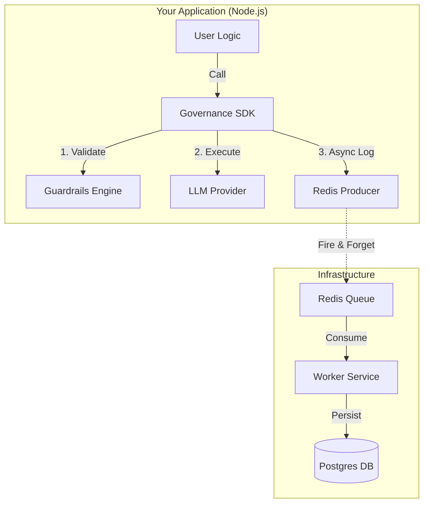
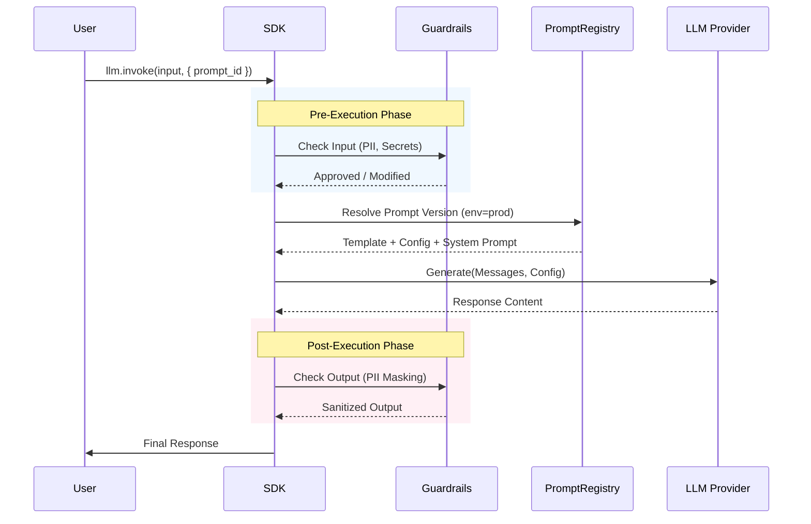
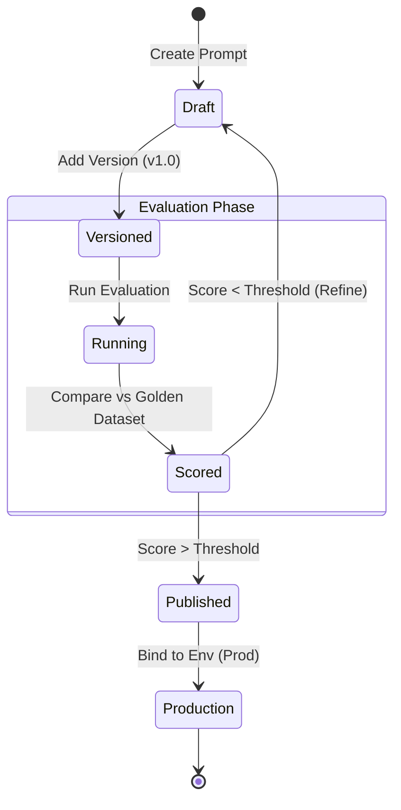

# LLM Governance SDK

> **Enterprise-grade in-process instrumentation for securing, observing, and managing LLM applications.**


This library provides a unique, drop-in SDK for Large Language Model (LLM) governance. Unlike traditional gateway-based solutions that introduce latency and single points of failure, this SDK instruments your application directly—similar to APM tools. It automatically enforces security guardrails, tracks costs, manages prompt versions, and runs evaluations against ground truth datasets.

## 🚀 Features

### 🛡️ Guardrails & Security
- **In-Process Protection**: Validates inputs and outputs directly within your application process with zero network latency.
- **PII Detection & Masking**: Automatically redacts sensitive data (Email, Phone, Credit Cards) from model responses based on configurable policies.
- **Secret Detection**: Blocks requests containing API keys or private tokens before they reach the model.
- **Policy as Code**: Define rules in `YAML` files that live with your code.

### 🧪 Evaluation & Prompt Engineering
- **Prompt Versioning**: Manage and version prompts programmatically. Bind specific versions to environments (dev, test, prod).
- **Automated Evaluation**: Run evaluations against "Golden Datasets" (Ground Truth) to verify model performance.
- **AI Judges**: Built-in support for using LLMs as judges to score relevance, accuracy, and hallucination risk.
- **Regression Testing**: Ensure new prompt versions don't break existing functionality before deployment.

### 👁️ Observability & Cost
- **Zero-Latency Logging**: Telemetry is offloaded asynchronously to a local queue (BullMQ), ensuring your user experience is never impacted by logging overhead.
- **Distributed Tracing**: OpenTelemetry integration for full request visibility.
- **Cost Attribution**: Real-time cost calculation per provider, model, and prompt.
- **Resilient Persistence**: Dedicated Worker service handles database writes; your app stays up even if the DB is down.

## 🏗️ Architecture

The SDK follows a "Producer-Consumer" model to ensure high performance and reliability. Heavy lifting (logging, persistence) is offloaded to a background worker.



## 🛠️ Getting Started

### Prerequisites
- **Node.js 20+**
- **Docker & Docker Compose** (for Redis/Postgres)

### 1. Installation

```bash
# Clone the repo (Monorepo setup)
git clone https://github.com/your-org/llm-governance.git
cd llm-governance
npm install
```

### 2. Start Infrastructure
Start Redis (for the queue) and Postgres (for logs).

```bash
docker-compose up -d
npx prisma db push --schema=libs/common/prisma/schema.prisma
```

### 3. Start the Worker Service
The worker consumes logs from the queue and persists them to the database.

```bash
npm run start:worker
```

### 4. Use the SDK in Your App

Initialize the SDK and wrap your LLM calls.

```javascript
import llm from '@llm-governance/sdk';

// 1. Initialize with your policy
llm.init({
    policyPath: './path/to/guardrails.yml'
});

// 2. Wrap your LLM calls
const response = await llm.observe({
    input: "User prompt",
    model: "gpt-4",
    provider: "openai",
    metadata: { user_id: "123" }
}, async () => {
    // Your existing code (e.g., OpenAI SDK)
    return await openai.chat.completions.create({
        model: "gpt-4",
        messages: [{ role: "user", content: "User prompt" }]
    });
});
```

### 5. Using llm.invoke (Gateway Mode)
The `invoke` method abstracts the provider and governance logic completely. It handles:
- **Guardrails**: Checks inputs and outputs against your policy.
- **Prompt Management**: Resolves managed prompts and versions.
- **Provider Switching**: Routes to the configured provider (OpenAI, Gemini, etc.).
- **Observability**: Automatically logs traces and metrics.



```javascript
// A. Direct Execution (Simple Text)
const response = await llm.invoke("What is the capital of France?", {
    provider: 'openai',
    model: 'gpt-4'
});

// B. Using a Managed Prompt
// The SDK fetches the prompt 'customer-service-bot', applies the version bound to 'prod',
// injects the input into {{user_input}}, and uses the model/provider defined in the prompt.
const response = await llm.invoke("How do I reset my password?", {
    prompt_id: 'customer-service-bot',
    env: 'prod' 
});

// C. Advanced Input (Prompt Variables)
const response = await llm.invoke({
    prompt_variables: {
        name: "Alice",
        topic: "Billing"
    }
}, {
    prompt_id: 'personalized-greeting'
});
```

### 6. Prompt Management & Evaluation
Manage prompts and run evaluations separately from your main application flow.



```javascript
// 1. Create a Prompt and Add a Version
const promptId = await llm.prompts.create({
    name: "customer-service-bot",
    description: "Main customer service agent"
});

await llm.prompts.addVersion({
    promptId: promptId,
    template: "You are a helpful assistant. Answer: {{user_input}}",
    version: "1.0.0",
    commitMessage: "Initial version"
});

// 2. Run an Evaluation
// Compare the prompt against a Golden Dataset
const results = await llm.evaluation.run({
    promptId: promptId,
    version: "1.0.0",
    dataset: [
        { 
            input: "Hello", 
            expected_traits: { tone: "friendly" } 
        }
    ],
    config: {
        provider: "openai",
        model: "gpt-3.5-turbo"
    }
});

console.log(`Evaluation Score: ${results.scores.overall}`);
```

### 7. Run the Demos

**SDK Instrumentation Demo:**
```bash
node examples/sdk-demo.js
```

**Evaluation Demo:**
```bash
# Runs with a Mock Provider to simulate LLM and Judge responses
NODE_ENV=test node examples/eval-demo.js
```

**Gateway Feature Demo:**
```bash
node examples/gateway-feature-demo.js
```

**Invoke Method Demo:**
```bash
node examples/invoke-demo.js
```

## ⚙️ Configuration

### Guardrails Policy
Define your security rules in a YAML file (e.g., `policies/default.yml`):

```yaml
input:
  secrets_detection:
    enabled: true
    action: reject

output:
  pii_detection:
    enabled: true
    categories: [email, phone]
    action: mask
    mask_token: "[REDACTED]"
```

## 📊 Comparison

| Feature | Gateway Approach (Old) | SDK Approach (New) |
| :--- | :--- | :--- |
| **Integration** | Requires changing API endpoints | Import library, wrap code |
| **Latency** | Network hop added | Microseconds (In-process) |
| **Failure Mode** | Gateway down = App down | DB down = App keeps working (Async queue) |
| **Complexity** | High (Separate service to manage) | Low (Part of your app) |

## 🤝 Contributing

We welcome contributions! Please see [CONTRIBUTING.md](CONTRIBUTING.md) for details.

## 📄 License

MIT License. See [LICENSE](LICENSE) for details.
